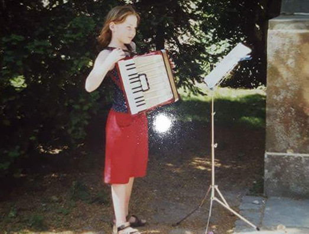

</body>

 

I'm a Masters student in Clinical Neuroscience, currently writing my thesis. Throughout my studies, I have peeked into various fields within Psychology - Differential Psychology, Forensic Psychology, Comparative Psychology, Neuropsychology - and worked in each for substantial amount of time or projects. In my first year, I had the amazing opportunity to work with [Florian Lange](https://feb.kuleuven.be/BEE/research-team/florian-lange/), an incredible researcher and good friend, and discover the irreproducability of ego depletion effects and participate in high quality replications even prior to the emergence of the reproducibility crisis in 2015. For three years, I was involved in the forensic assessment of victims  of sexual assault with [Prof. Daniela Hosser](https://www.tu-braunschweig.de/psychologie/abt/epf/mitarbeiter/hosser), one of the most inspiring female role models for me. I was able to aqcuire teaching experience in the [KinderUni 2013](https://www.tu-braunschweig.de/presse/veranstaltungen/kinderuni/archiv/2013) of the TU Braunschweig, as a lecturer for JGW.ev in the [Schuelerakademie Papenburg 2017](https://jgw-ev.de/schuelerakademie/archiv/schulerakademie-papenburg-i-2017/), and as a statistics tutor for first year B.Sc. Psychology students at the OvGU Magdeburg in the academic year 2017/2018.
In the last year of my Bachelors studies, I had the extremely valuable possibility to work with [Dr. Ljerka Ostojic](https://www.researchgate.net/profile/Ljerka_Ostojic), the toughest women and most capable, integer scientistic I have met so far, in the [comparative cognition lab](https://www.psychol.cam.ac.uk/research/ccl) in Cambridge on pseudo-episodic memory and social cognition of corvids, and also experience that none of the academic frustrations would yet be able to discourage me from pursueing a career in science.
From 2016 - 2018, in parallel to my Masters studies, I was a research associate at the [Forschungsgemeinschaft fuer kognitive Neurologie e.V.](https://www.klinikum-braunschweig.de/284.0.html) at the Clinic of Neurology in Braunschweig, conducting my first independent research project concerned with improving the detection of dementia, especially of the Alzheimer type.
Finally, after all these valuable detours, I found my call in Psychoinformatics, at the intersection of Neuroscience, Computer Science, Statistics and Psychology. Thanks to [Michael Hanke](https://github.com/mih), my current Masters thesis and future Ph.D. supervisor, the other amazing [psychoinformatics lab members](http://www.psychoinformatics.de/lab-members.html) (one of them seen on the right in our usual way of interacting with eachother), [Yaroslav Halchenko](https://github.com/yarikoptic) and the [Haxby Lab](http://haxbylab.dartmouth.edu/index.html), I'm now on my way to slowly become a psychoinformatician. 

 To not be completely boring I've cultivated a few exiting hobbies. I'm a deep sea diver (PADI), I've started skiing when I was barely able to walk, I used to do pole fitness, been a model in the UK (it was a weird conincidence that got me there). I really suck at music, especially, but not limited to, accordeon, even though it looked cute once. 

 

 
(I also don't know how I've transformed from Pumuckl with an accordeon to vulgar scientists, but well, it is what it is)
